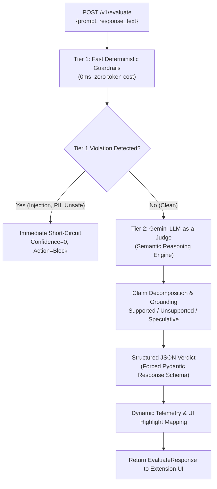

# Two-Tier Hybrid Verification Engine Redesign (LLM-as-a-Judge)

## Context & Objective
The frontend Chrome extension UI implementation is complete and functioning. However, the initial backend evaluation pipeline relied on superficial heuristics (hedging ratios, regex pattern matches, TF-IDF cosine similarity) that lacked semantic understanding of ground truth or factual grounding.

This document details the architectural refactoring of the ControlPlane.ai backend into a **Two-Tier Hybrid Verification Engine** combining deterministic rule-based checks with Google's Gemini API acting as an objective **LLM-as-a-Judge**.

---

## Two-Tier Architecture Overview



---

## Tier Breakdown

### Tier 1: Fast Deterministic Heuristics (Token Saving)
Runs locally with zero external API calls:
1. **Prompt Injection & Jailbreak Scanner** (`app/checkers/injection_detector.py`): Direct injection, role hijacking, instruction overrides, zero-width Unicode, Base64/ROT13 encoding scans.
2. **PII Scanner** (`app/checkers/pii_scanner.py`): High-speed regex + Luhn checksum validation for credit cards, SSNs, API tokens, and emails.
3. **Content Safety** (`app/checkers/content_safety.py`): Word-boundary keyword filters for violence, self-harm, hate speech, and dangerous materials.

> **Short-Circuit Optimization**: If Tier 1 detects critical prompt injection or dangerous content, the request terminates immediately with `action=block`, saving API token costs.

---

### Tier 2: Gemini API Semantic Brain (LLM-as-a-Judge)
For requests passing Tier 1, Gemini evaluates the prompt-response pair:
1. **Claim Decomposition**: Extracts individual factual and reasoning claims from the AI response.
2. **Grounding & Faithfulness Verification**: Checks whether each claim is supported by factual knowledge, scientifically grounded, or a hallucinated fabrication.
3. **Multi-Dimensional Scoring**:
   - **Performance / Reliability**: Accuracy, hallucination risk level, grounding score.
   - **Cost / Efficiency**: Token consumption, hallucination rework potential.
   - **Responsibility / Safety**: Tone compliance, neutrality, bias detection.
4. **Structured JSON Output**: Uses Gemini's `response_schema` feature to guarantee strict compliance with the frontend interface contract.

---

## Data Contract: Structured Gemini Output Schema

```python
class GeminiClaimVerdict(BaseModel):
    claim_text: str
    grounding: Literal["supported", "speculative", "unsupported", "fabricated"]
    confidence: int  # 0-100
    reasoning: str

class GeminiSegmentVerdict(BaseModel):
    text: str
    classification: Literal["verified", "ambiguous", "hallucination"]
    confidence: int
    badge: str
    reasons: list[str]

class GeminiEvaluation(BaseModel):
    overall_confidence: int
    risk_level: Literal["low", "medium", "high", "critical"]
    recommended_action: Literal["allow", "flag", "reword", "block"]
    claims: list[GeminiClaimVerdict]
    segments: list[GeminiSegmentVerdict]
    performance_score: int
    cost_score: int
    responsibility_score: int
    accuracy: int
    hallucination_risk_level: Literal["low", "medium", "high"]
    hedging_ratio: float
    prompt_alignment: float
    fabrication_signals: list[str]
    bias_detected: bool
    tone_compliance: int
```

---

## Comparison: Old Heuristic vs. New Hybrid Engine

| Scenario | Old Heuristic Result | New Two-Tier Hybrid Result |
|---|---|---|
| *"The capital of France is Berlin."* | 🟢 Verified (No hedging phrases) | 🔴 Hallucination (Factually false claim) |
| *"I think AI adoption is growing across supply chains."* | 🔴 Flagged (Penalized for "I think") | 🟢 Verified (Cautious but factually sound) |
| *"According to example.com/study, 100% of jobs are automated."* | 🔴 Flagged (Regex match on example.com) | 🔴 Hallucination (Fabricated URL & unsupported stat) |
| *"Quantum computers may eventually break standard RSA encryption."* | 🟠 Ambiguous (Hedged wording) | 🟢 Verified (Accurate scientific claim) |

---

## Graceful Fallback Strategy
If `GEMINI_API_KEY` is not present in the environment (e.g. offline testing or local development), the system automatically falls back to deterministic heuristics to ensure tests and offline development workflows continue without interruption.
